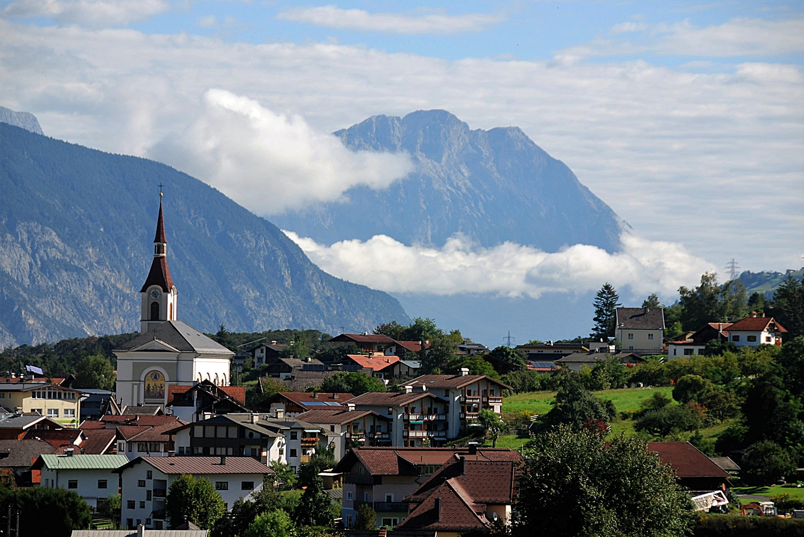

# Wels
Wels, in Österreich, ist mit 61.233 Einwohnern (Stand 1. Jänner 2018) die zweitgrößte Stadt des Bundeslandes Oberösterreich nach der Landeshauptstadt Linz und belegt auf der Liste der Städte Österreichs den achten Platz. 

##Geografie
###Lage
Wels liegt inmitten des Bezirks Wels-Land am linken Ufer der nach Nordosten fließenden Traun im Hausruckviertel auf 317 m ü. A., gemessen im Zentrum bei der Stadtpfarrkirche.

###Stadtgliederung
Wels gliedert sich in die sechs Stadtteile: Innere Stadt und rundum im Uhrzeigersinn von SW bis NO: Lichtenegg, Vogelweide, Neustadt, Pernau und Puchberg.

##Geschichte
###Uhrzeit
Die ältesten Funde aus der Gegend von Wels stammen aus der jüngeren Steinzeit, also dem Zeitraum von 3500 bis 1700 v. Chr. Man fand einfache Werkzeuge, vor allem am Ufer der Traun und im heutigen Zentrum der Stadt.

###Römerzeit
Die kleine Siedlung entwickelte sich zu einem wichtigen Stützpunkt und Außenposten des Römischen Reiches. Unter Kaiser Hadrian wurde das damalige Ovilava zu einer Stadt (municipium) erhoben. Das bebaute Gebiet schloss das Gebiet von der Traun bis zur Höhe des heutigen Kaiser-Josef-Platzes ein. Es gab bereits Häuser aus Ziegeln, Dampfbäder, eine Arena sowie ein Bewässerungssystem, das Wasser vom jenseits der Traun liegenden Reinberg brachte.

##Bevölkerung
17 % der Wohnbevölkerung sind unter 15 Jahre, 63 % sind 15 bis 59 Jahre alt und somit 20 % 60 Jahre oder älter (Volkszählung 2001).

###Demografie
Der Ausländeranteil beträgt etwa 21,6 % (laut Statistik Austria). Etwa 28 % der Bevölkerung sind nicht in Österreich geboren (Angabe Statistik Austria 2015). Die wichtigsten Herkunftsländer sind – in absteigender Reihenfolge nach der Staatsbürgerschaft der Bewohner geordnet – Bosnien-Herzegowina, Türkei, Kroatien und die ehemalige Bundesrepublik Jugoslawien („Serbien-Montenegro“).

###Religion
Die größte religiöse Gemeinde ist die römisch-katholische. Ihr gehören etwa 63 % der Stadtbevölkerung an. Die nächstgrößere Gruppe ist die der Bekenntnislosen, der 14 % angehören. Etwa 10 % gehören der islamischen Religion und 7 % der evangelischen Kirche an. Der Rest verteilt sich auf orthodoxe und sonstige Religionsgemeinschaften.

##Wirtschaft
Wels hat etwa 40.000 Beschäftigte in über 4000 Unternehmen, wobei 22.600 Menschen regelmäßig aus der Umgebung nach Wels und 8.600 Menschen aus Wels in die umliegenden Gemeinden pendeln.

Über 60 % der Beschäftigten sind im Dienstleistungssektor tätig. Die meisten Unternehmen in diesem Sektor operieren im Handel, der Rest verteilt sich auf Soziales, den öffentlichen Dienst sowie das Finanz- und Transportwesen. Das zweite wirtschaftliche Standbein ist das produzierende und verarbeitende Gewerbe. Das Industriegebiet von Wels befindet sich in der Pernau. Es gibt dort Firmen der chemischen Industrie, Möbelerzeuger, Maschinenbauer und diverse Großhändler.

##Referenz
[I'm an inline-style link](https://de.wikipedia.org/wiki/Wels_(Stadt))

##Bild
