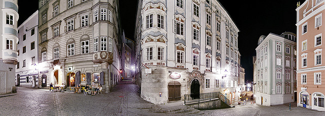

# Linz

Linz ist die Landeshauptstadt von Oberösterreich und mit 203.012 Einwohnern (Stand 1. Jänner 2017) 
nach Wien und Graz die drittgrößte Stadt Österreichs und das Zentrum des mit 771.695 Menschen zweitgrößten 
Ballungsraumes der Alpenrepublik.

Die Stadt an der Donau hat eine Fläche von 96,048 km² und ist Zentrum des oberösterreichischen Zentralraums. 
Als Statutarstadt ist sie sowohl Gemeinde als auch politischer Bezirk mit Sitz der benachbarten Bezirkshauptmannschaften 
von Linz-Land und Urfahr-Umgebung.

### Geschichte

Nach dem Ende des Zweiten Weltkriegs, 1945, hatte Linz lange den Ruf einer staubigen Stahlstadt, den sie dem größten Arbeitgeber, 
den Stahlwerken der Voestalpine AG, verdankte.  Doch durch verbesserten Umweltschutz und zahlreiche Initiativen im Kulturbereich, 
beispielsweise Veranstaltungen wie die Linzer Klangwolke, das Brucknerfest, das Pflasterspektakel und den Prix Ars Electronica bzw. 
das Ars-Electronica-Festival, gewinnt die Stadt sukzessive ein neues Image. Seit 2004 wird jährlich das Filmfestival Crossing Europe 
veranstaltet. Linz konnte sich – zuletzt mit dem 2013 eröffneten neuen Musiktheater am Volksgarten, einem Landestheater, 
– als Kulturstadt positionieren, obwohl Strukturen der alten Industriestadt ebenso wie ländliche Lebensformen nach wie vor sichtbar sind.

Ziel ist daher, die kulturelle Vielfalt aufrechtzuerhalten und darzustellen. Auch nach dem Jahr als Kulturhauptstadt 
soll die Internationalisierung weitergeführt und die Netzwerke ausgebaut werden. Das Netzwerk der Creative Cities umfasst 
die Bereiche Literatur, Film, Musik, Handwerk und Volkskunst, Design, Gastronomie sowie Medienkunst.[6] Die insgesamt 69 
Städte teilen ihre Erfahrungen und überlegen wie sie am besten mit der Globalisierung zurechtkommen. Um einen möglichst 
intensiven Diskurs mit den anderen Mitgliedsstädten zu ermöglichen muss Linz nach einigen Jahren eine Selbstevaluierung 
durchführen. Nach drei Jahren überprüft die UNESCO ob Linz bestimmte Maßnahmen im Bereich Medienkunst gesetzt hat und weiterhin 
den Titel führen darf.[7] Auf Grund der langjährigen Erfahrung und dem gewonnenen Know-how kann Linz sich weiterhin in das 
Creative Cities Netzwerk einbringen und als „kreatives Zentrum“ im internationalen Wettbewerb von Nutzen sein. Neben Linz 
zählen auch Enghien-les Bains, Lyon, Sapporo, Dakar, Gwangju, Tel Aviv-Jaffa und York zu den „Cities of Media Arts“.[8]

Quelle: https://de.wikipedia.org/wiki/Linz
Fotos Quelle: Flickr.com

