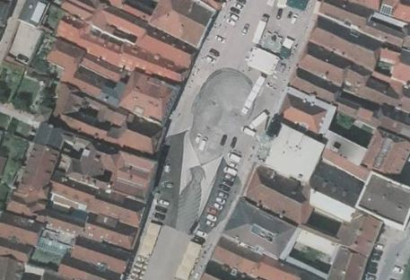

#Steyr
Steyr ist eine Stadt in Oberösterreich und nach Linz und Wels die drittgrößte Stadt des Bundeslandes und die zwölftgrößte Stadt Österreichs. Die Statutarstadt am Zusammenfluss von Enns und Steyr ist Sitz der Bezirkshauptmannschaft des Bezirkes Steyr-Land.

Bis vor kurzem war einer der berühmtesten Bürger der Neuzeit Franz Josef Hartlauer.
Mittlerweile hat \- zumindest kurzfristig \- Franz\-Josef Hingerl Herrn Hartlauer in der öffentlichen Wahrnehmung den Rang abgelaufen. Es ist jener schlitzohrige Magistratsbedienstete, der \- ohne, daß es wochenlang aufgefallen wäre -\ seine Initialen in das Steyrer Pflaster verewigt hatte.
Tja, es fiel doch auf und dann folgte ein unrühmlicher Versuch, die Buchstaben mit den Anfangsbuchstaben von Geschäften zu rechtfertigen:

* H für die Bäckerei Hohlrieder
* I für die Pizzeria Imperial
* N für das Schuhgeschäft Nanu
* G für den Juwelier Gröger
* E für das E-Banking der Oberbank (wtf\!)
* R für das Rathaus
* L für das Obstgeschäft Leopold

Tja, leider gibt es in meiner schönen Heimatstadt keine Erste Bank, sondern eine Oberbank, sonst wäre die Erläuterung für die Buchstaben ja schon beinahe glaubwürdig gewesen.

So viel Publicity hatte Steyr schon lange nicht mehr. Nun gibt es auch schon viele, nicht ernst gemeinte, Ratschläge für eine neue Pflasterung:

