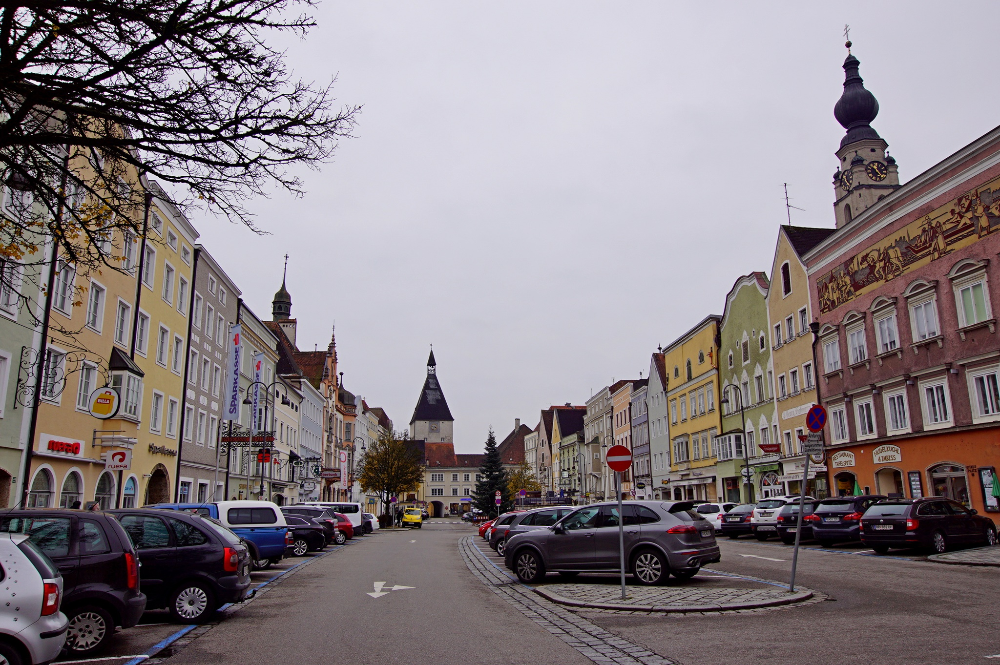

#Braunau am Inn 

Braunau am Inn ist die älteste und mit 17.095 Einwohnern (Stand 1. Jänner 2018) bevölkerungsreichste Stadtgemeinde im Innviertel in Oberösterreich. Die Grenzstadt am Inn bildet mit der gegenüberliegenden deutschen Stadtgemeinde Simbach am Inn in Bayern ein grenzübergreifendes Mittelzentrum. Braunau ist Sitz der Bezirkshauptmannschaft vom Bezirk Braunau am Inn. Weltweit bekannt ist Braunau als Geburtsort Adolf Hitlers.

##Geografische Lage
Braunau am Inn liegt im Innviertel auf 352 m Höhe, etwa 15 km östlich des Zusammenflusses von Inn und Salzach.

Die geografische Ausdehnung beträgt 7,8 km von Nord nach Süd, sowie 9,1 km von West nach Ost.[1] Das Stadtgebiet umfasst 24,7 km² Fläche, von denen 16,2 % bewaldet sind und 53,0 % landwirtschaftlich genutzt werden.

Braunau am Inn liegt rund 60 km nördlich von Salzburg und auf etwa halber Strecke je rund 110–120 km östlich von München und westlich von Linz entfernt.

Quelle: https://de.wikipedia.org/wiki/Braunau_am_Inn

