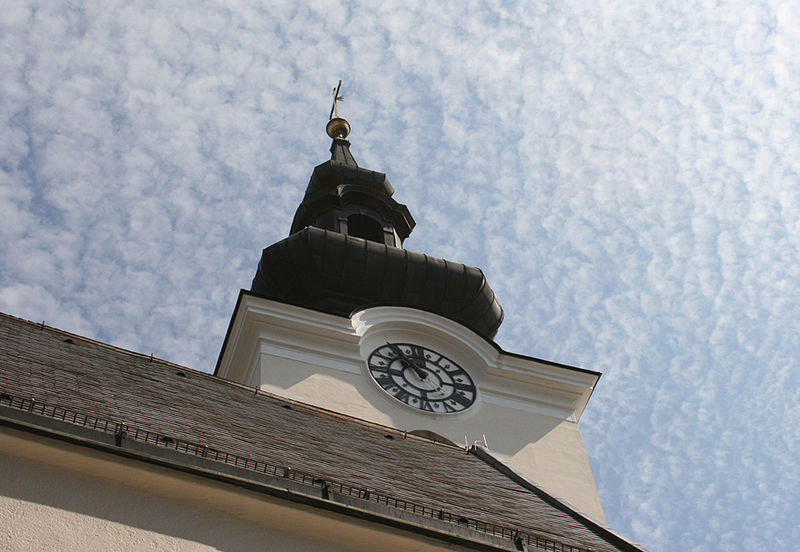

# Gallneukirchen

Gallneukirchen ist eine Stadtgemeinde im Unteren Mühlviertel im Bezirk Urfahr-Umgebung. Mit einer Fläche von 5,15 Quadratkilometern und 6492 Einwohnern (Stand 1. Jänner 2018) ist Gallneukirchen flächenmäßig die kleinste und bezogen auf die Einwohneranzahl die zweitgrößte Gemeinde des Bezirks. Die Gemeinde liegt im Gerichtsbezirk Urfahr.

1125 wurde der an einem Handelsweg von Linz über Freistadt nach Böhmen gelegene Ort erstmals urkundlich erwähnt. Ab 1145 war Gallneukirchen dem Inhaber des Schlosses Riedegg untertan. Um 1260 erhielt der Ort das Marktrecht.

Die ab 1832 durch Gallneukirchen führende Pferdeeisenbahn Budweis–Linz–Gmunden bewirkte einen wirtschaftlichen Aufschwung des Ortes. 1873 wurde der Vorläuferverein des heutigen evangelischen Diakoniewerks gegründet. Die Lage im sogenannten „Speckgürtel“ von Linz bewirkt seit den 1960er-Jahren einen starken Bevölkerungszuwachs. Auf Grund der steigenden Bedeutung des Marktes erfolgte 2001 die Erhebung zur Stadt. Der Slogan der Stadt lautet „Stadt erleben, Land genießen“.

## Geografie

Das Ortszentrum von Gallneukirchen liegt 14 Kilometer nordöstlich der Landeshauptstadt Linz im Unteren Mühlviertel in einer weitläufigen Talsenke, dem Gallneukirchner Becken.

Das Gemeindegebiet bedeckt eine Fläche von 5,15 Quadratkilometern. Die größte Ausdehnung in Ost-West-Richtung beträgt 3 und in Nord-Süd-Richtung 2,9 Kilometer.

Die höchste Erhebung befindet sich nördlich des Ortszentrums in der Nähe von Punzenberg auf rund 456 m ü. A. und der tiefste an der Großen Gusen nächst der Grenze zur Nachbargemeinde Engerwitzdorf (Ortsteil Schweinbach) auf rund 333 m ü. A. Das Zentrum Gallneukirchens liegt auf 337 m ü. A.

Gallneukirchen gehört zum Granit- und Gneisplateau, dem österreichischen Anteil der Böhmischen Masse. Aus geologischer und geomorphologischer Sicht sowie unter Aspekten der Raumnutzung gehört der nördliche Teil des Gemeindegebietes zur oberösterreichischen Raumeinheit Zentralmühlviertler Hochland, während der südliche Teil in die Raumeinheit Südliche Mühlviertler Randlagen fällt.

Im Norden des Gemeindegebietes besteht der Untergrund aus Engerwitzdorfer Granit und Migmagranit. Der Anteil am Gallneukirchner Becken im südlichen Teil des Gemeindegebietes besteht aus tertiären Ablagerungen auf Mauthausner Granit. Die Ablagerungen bildeten zum größten Teil Schlier und im Übrigen Sande. Entlang der Fließgewässer finden sich Alluvionen, wo zahlreiche Fossilien gefunden wurden.

Die Große Gusen durchfließt das Gemeindegebiet von Nord nach Süd in Richtung Donau. Im Gemeindegebiet mündet der Mirellenbach in die Gusen. Namhafte Stillgewässer sind auf Grund der kleinen Gemeindefläche nicht vorhanden.

## Stadtgliederung

Der ehemalige Markt Gallneukirchen ist jeweils mit denselben Grenzen seit 1784 Katastralgemeinde und seit 2001 Stadtgemeinde mit dem Ortsteil Gallneukirchen.

Die Verteilung der Flächennutzung zeigt, dass die land- und forstwirtschaftlichen Nutzflächen 75 % und Gärten 13,5 % der Gemeindefläche ausmachen.

## Nachbargemeinden

Gallneukirchen ist von den Gemeinden Alberndorf in der Riedmark, Engerwitzdorf und Unterweitersdorf umgeben. Die ersten beiden gehören zum Bezirk Urfahr-Umgebung, die letztgenannte zum Bezirk Freistadt. Im Westen und Süden ist Gallneukirchen mit den Ortsteilen Linzerberg, Klaus, Schweinbach und Simling der Nachbargemeinde Engerwitzdorf zusammengewachsen.[2]

Gallneukirchen ist Mitglied im Verein für regionale Entwicklung Gusental, dem fünf weitere Gemeinden entlang der Gusen angehören. Die Gründung eines Interkommunalen Betriebsansiedlungsgebiets in Alberndorf ist gemeinsam mit einigen der Nachbargemeinden geplant.

*Text und Links wurden übernommen von [Wikipedia](https://de.wikipedia.org/wiki/Gallneukirchen)*

*Kirchturm Gallneukirchen. (Bild von [Klemens Doppler](https://en.wikipedia.org/wiki/Gallneukirchen#/media/File:Gallneukirchner_Kirchturm.jpg) under the [Creative Commons Attribution-ShareAlike 3.0](https://creativecommons.org/licenses/by-sa/3.0/) License.)* 