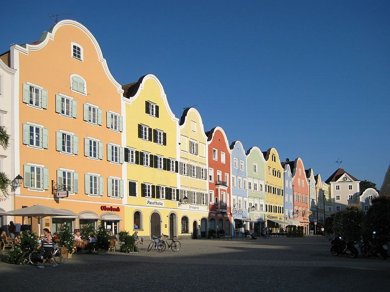

#Schärding
Schärding (Bairisch: Scháréng) ist eine Stadt in Oberösterreich mit 5253 Einwohnern (Stand 1. Jänner 2018). Sie liegt am Inn, südlich von Passau, am westlichen Rand des Innviertels, und ist als Bezirkshauptstadt gleichzeitig lokales Zentrum für den umliegenden Bezirk.

##Geografie
Schärding liegt auf 313 m Höhe im Innviertel. Die Ausdehnung beträgt von Nord nach Süd 4,1 km, von West nach Ost 1,9 km. Die Gesamtfläche beträgt 4,08 km². 2,4 % der Fläche sind bewaldet, 31,7 % sind landwirtschaftlich genutzt.

Der Inn bildet die Grenze zum benachbarten Freistaat Bayern. Direkt gegenüber liegt auf der bayrischen Seite des Inns die Gemeinde Neuhaus am Inn, die über zwei Innbrücken erreichbar ist.

Quelle: https://de.wikipedia.org/wiki/Sch%C3%A4rding

