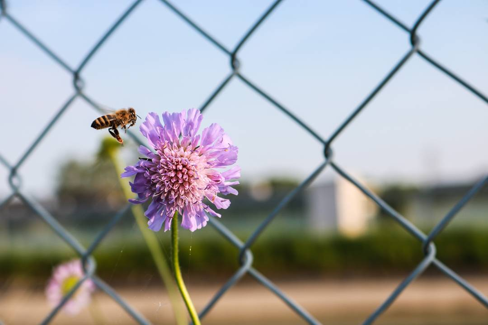
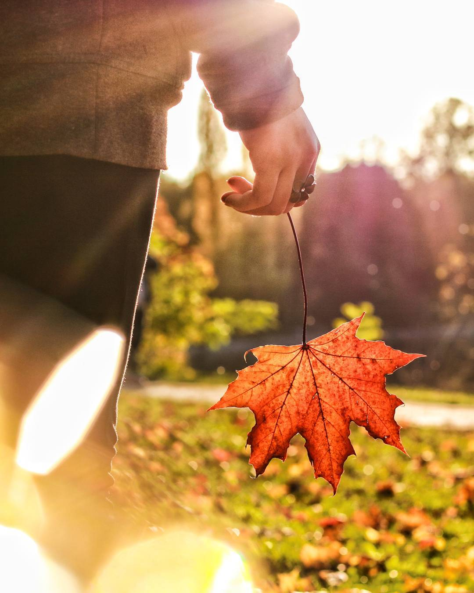

# Kleinmünchen

An diesem Ort, wo ich seit meiner Geburt wohne, gibt es
* ein Ärztezentrum
* zwei Kindergärten
* eine Krabbelstube
* ein örtliches Einkaufszentrum
* eine Volksschule
* eine Hauptschule
* ein Schwimmbad
* ein Wasserwald

Was mir an Kleinmünchen so gefällt ist, dass wir zwei kleine Parks und einen Wasserwald haben, wo man den ganzen Schulstress einfach entkommen kann. Somit muss ich auch nicht extra weit rausfahren, um meine Hobbys wie Fotografie nachzugehen. Darunter sind ein paar meiner Fotos zu sehen:

Kleinmünchen hat auch eine eigene [Website](http://www.klikk.at/).
