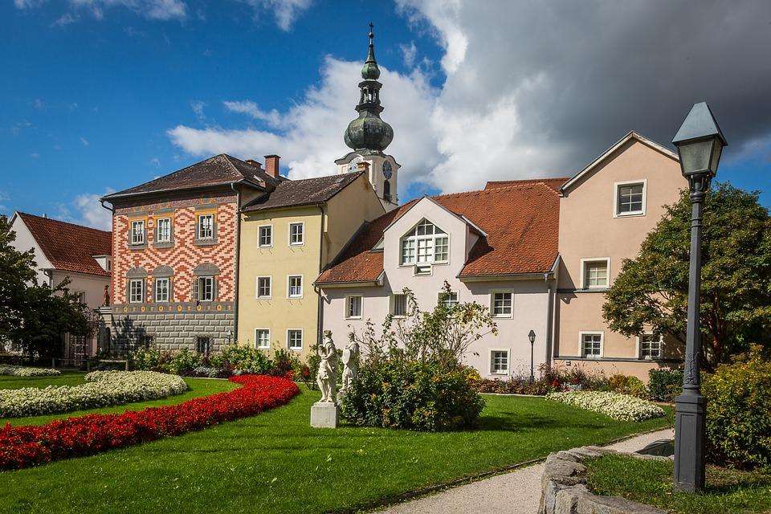
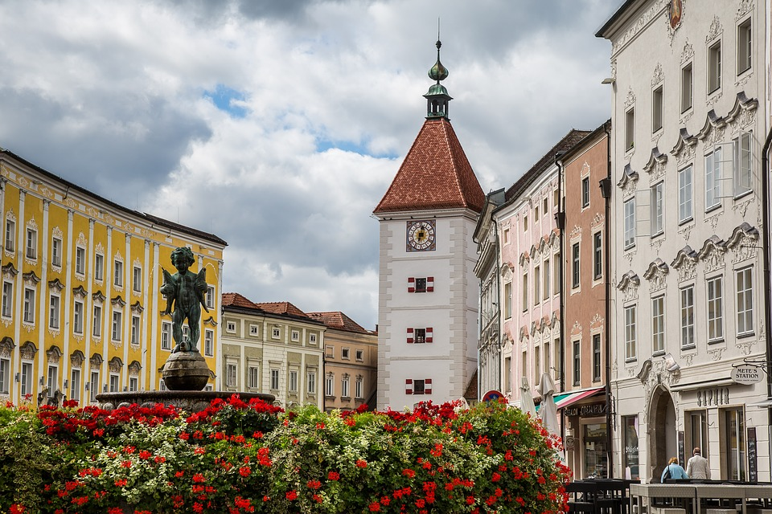

# Stadt Wels

Wels in [Österreich](https://de.wikipedia.org/wiki/%C3%96sterreich) ist ein Juwel im [Bundesland Oberösterreich](https://de.wikipedia.org/wiki/Ober%C3%B6sterreich), welches sich an die Traun schmiegt. 

## Allgemeines

Sie ist die achtgrößte Stadt in Österreich und beherbergt 61.233 Einwohner *(Stand 1.Jan. '18) und existierte schon während der Römerzeit. Heutzutage ist sie vor allem als Messe- und Industriestadt wichtig und dient als Verkehrsknotenpunkt für das ganze Bundesland.

## Erholungsmöglichkeiten

Entlang der Traun sind Erholungsflächen zu finden entlang des Traunuferwegs und es führen größere Radwege durch die Stadt. Der Tiergarten der Stadt ist der ältestete Oberösterreichs und bietet bei freien Eintritt Einblick in unterschiedlichste Biotope.

*Text und Links wurden übernommen von [Wikipedia](https://de.wikipedia.org/wiki/Wels_(Stadt))*

## Bilder der Stadt Wels

*Garten der Stadt Wels. (Übernommen von [Pixabay](https://pixabay.com/en/wels-city-of-wels-austria-3732827/))*

*Ledererturm. (Übernommen von [Pixabay](https://pixabay.com/en/wels-city-of-wels-austria-3732831/))*