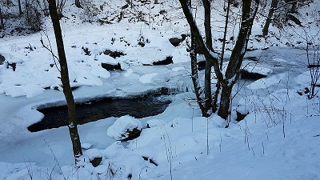

# k01608769

**Mein Heimatort Kefermarkt:**

Kefermarkt liegt auf 516 m Höhe im Mühlviertel. 
Die Ausdehnung beträgt von Nord nach Süd 7,4 km und von West nach Ost 8,9 km. 
Die Gesamtfläche beträgt 27,8 km². 
7,6 % der Fläche sind bewaldet und 81,5 % der Fläche landwirtschaftlich genutzt.

**Sehenswürdigkeiten**:
* Schloss Weinberg
* Kefermarkter Flügelaltar

**Öffentliche Einrichtungen und Bildung**:

Im Ort stehen ein Kindergarten und eine Volksschule zur Verfügung. 
Zusätzlich besteht eine Bücherei. Weiters gibt es einen Allgemeinmediziner in der Gemeinde.
Im Gemeindegebiet existiert die Freiwillige Feuerwehr Kefermarkt.

**Nachbargemeinden**:
* Freistadt
* Neumarkt
* Lasberg
* Gutau
* Pregarten

*Quelle: 
https://de.wikipedia.org/wiki/Kefermarkt*

