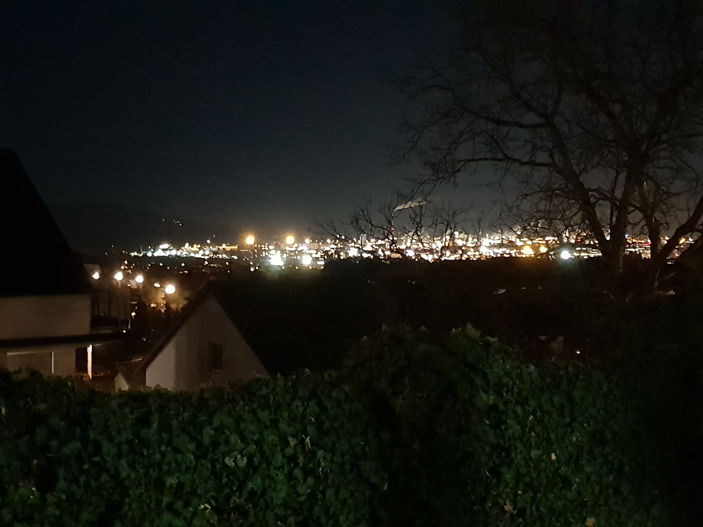

# Meine Heimat

## Zwischen Grün und Grau

Grade an der Grenze der Stadt kann man innerhalb von 5 Geh-Minuten sowohl des Betonbaus in die eine Richtung genießen sowie in die entgegengesetzte Richtung frischen Kuhmist begutachten.

## Theoretisch eine Gute Aussicht

Von meinem Küchenfenster aus kann ich Nachts das Prachtvolle Lichtermeer der Stadt bewundern, mit gelegentlichen Dunklen Linien mittendrin die die Farbenpracht noch weiter hervorheben. Zumindest im Winter, das restliche Jahr über trägt der Baum vom Nachbarn Blätter.

Copyright: Selbstgemachtes Bild
