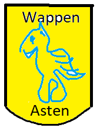

#Asten
*Wohnort von Andreas Bochis*

Asten ist eine österreichische Marktgemeinde im Bezirk Linz-Land im Bundesland Oberösterreich mit 6613 Einwohnern (Stand 1. Jänner 2018).  
Die Gemeinde war ursprünglich Teil des Gerichtsbezirks Enns, seit 1. Jänner 2014 gehört die Gemeinde zum Gerichtsbezirk Steyr.  

##Geografie  
Asten liegt auf 255 m Höhe im Zentralraum. Die Ausdehnung beträgt von Nord nach Süd 3,8 km, von West nach Ost 4,1 km. Die Gesamtfläche beträgt 8,48 km²,   
womit Asten die flächenmäßig kleinste Gemeinde des Bezirks Linz-Land ist. 14,1 % der Fläche sind bewaldet, 54,1 % der Fläche sind landwirtschaftlich genutzt.  

###Gemeindegliederung  
Die Marktgemeinde Asten besteht aus den Katastralgemeinden Asten (400,91 Hektar) und Raffelstetten 447,70 Hektar).   
Die Katastralgemeinde Raffelstetten nimmt dabei den Norden und Osten des Gemeindegebietes ein, die Katastralgemeinde Asten den Südosten.   
In der Katastralgemeinde leben rund 85 Prozent der Gemeindebevölkerung, wobei sich die Einwohner auf den Markt Asten (255 m ü. A.) mit der Häusergruppe Norikum (260 m ü. A.)   
und die Siedlung Fisching (255 m ü. A.) aufteilen. 2001 umfasste Asten 393 Gebäude und 3.048 Einwohner, Fisching 326 Gebäude und 2.055 Einwohner.   
Die beiden Ortsteile sind dabei bereits teilweise zusammengewachsen. In der Katastralgemeinde Raffelstetten befinden sich wiederum die Ortsteile Raffelstetten und Ipfdorf.   
Das Dorf Raffelstetten (246 m ü. A.) mit dem Einzelhof Hochhauser liegt dabei nördlich und südlich der Wiener Straße (B 1) und beherbergte 2001 202 Gebäude und 694 Einwohner.   
Die südlich gelegene Rotte Ipfdorf (253 m ü. A.) war hingegen mit 64 Gebäuden und 228 Einwohnern der kleinste Ortsteil.[1]   
Zwischen 2001 und 2011 konnten insbesondere die Ortschaften Asten und Raffelstetten an Einwohnern zulegen. 2011 kam Asten auf 3.158 Einwohner,   
Fisching hatte 1.996, Raffelstetten 850 und Ipfdorf 216 Einwohner.[2]  

**Das Gemeindegebiet umfasst folgende Ortschaften (in Klammern Einwohnerzahl Stand 1. Januar 2018[3]):**  

* Asten (3214)
* Fisching (2033)
* Ipfdorf (353)
* Raffelstetten (1013)

*Quelle: https://de.wikipedia.org/wiki/Asten*  